<!--
  The banner is generated: edit tools/build_banner.py and re-run
  `python tools/build_banner.py`, never the SVGs in assets/.

  Source order below is load-bearing. <picture> takes the first source whose
  media matches, so the reduced-motion variants have to come before the plain
  dark one, and the  is the light animated fallback for anything that
  matches nothing. The motion query has to live out here rather than inside the
  SVG -- inside an image-mode SVG it does not track the viewer's real setting.
-->
<picture>
  <source media="(prefers-reduced-motion: reduce) and (prefers-color-scheme: dark)" srcset="assets/attention-dark-still.svg">
  <source media="(prefers-reduced-motion: reduce)" srcset="assets/attention-light-still.svg">
  <source media="(prefers-color-scheme: dark)" srcset="assets/attention-dark.svg">
  
</picture>

hi, i'm michael. i'm a math &amp; ml researcher working on self-attention mechanisms and physics-informed neural networks. based in los angeles.

### selected work

- **[paper-verify](https://github.com/michae6345-crypto/paper-verify)** — checks whether an ml paper's own numbers agree with each other, and reports discrepancies with evidence. a language model never produces a verdict; it only extracts structure.
- **[PInnns](https://github.com/michae6345-crypto/PInnns)** — what happens to a physics-informed neural network when you switch optimizer and floating-point precision mid-training, across 7 conditions and several benchmark pdes.
- **[michae6345-crypto.github.io](https://github.com/michae6345-crypto/michae6345-crypto.github.io)** — personal site. plain html, one stylesheet, no build step.

### research

- **ml researcher @ ucla** — linear self-attention mechanisms, with a phd mentor · 2026
- **ml researcher @ cal state la** — nasa-funded spatiotemporal ml for air quality prediction · 2025
- **ml researcher @ algoverse ai** — benchmarking pinns across precision and optimizer settings · 2025

### elsewhere

[site](https://michae6345-crypto.github.io) · [x](https://x.com/MichaelTar23939) · [mm.tarekegn@gmail.com](mailto:mm.tarekegn@gmail.com)
